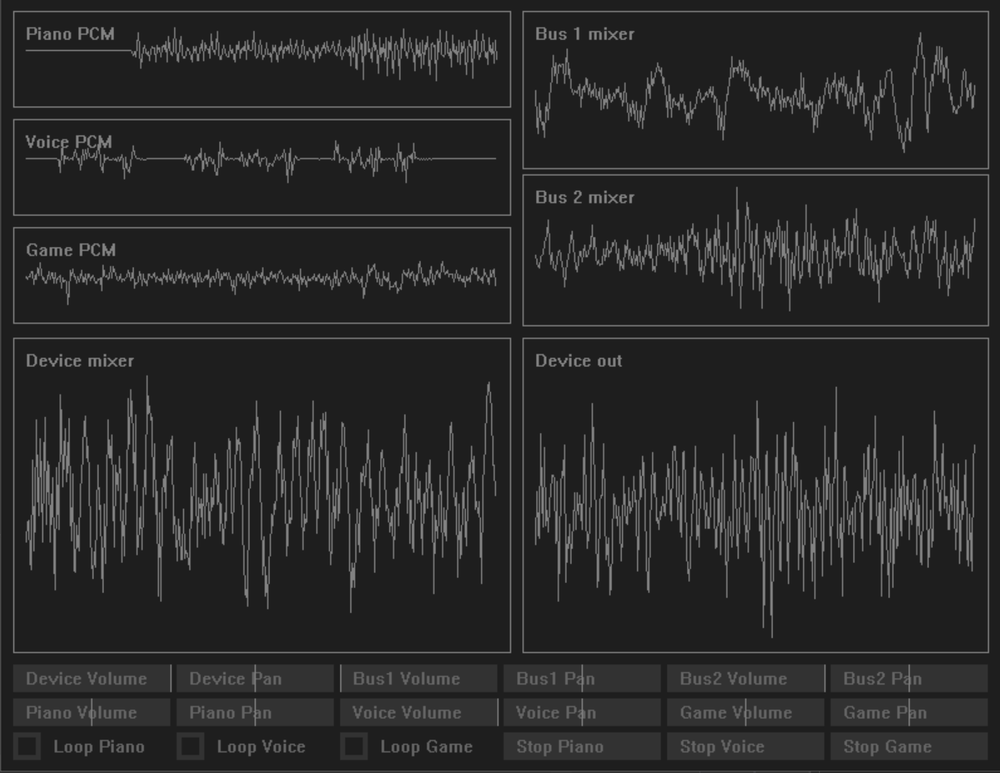

# SimpleSound



# Design

This is roughly the setup:

```
┌────────────────────────┐
│Queued Sounds           │
├────────────────────────┤
│                        │
│                        │
│                        │
│                        │
│                        │
│                        │
│                        │          Device Mixer
│                        │          ┌───────────────────────────────────────────────────┐
│                        │          │                                                   │
│                        │          │                                                   │
│                        │          │                                                   │
│                        │          │                                                   │
│                        │          │                                                   │
└────────────────────────┘          └───────────────────────────────────────────────────┘


Buffer A (50 ms)                                     Buffer B (50 ms)
┌───────────────────────────────────────────────────┬────────────────────────────────────────────────────┐
│                                                   │                                                    │
│                                                   │                                                    │
│                                                   │                                                    │
│                                                   │                                                    │
│                                                   │                                                    │
└───────────────────────────────────────────────────┴────────────────────────────────────────────────────┘
    ▲                                          playback buffer (100 ms)
    │
    │
    │
    │
  Current Play position
  ````

When the application starts, the playback buffer is cleared, but silence is playing. When the play position passes the halfway point of the playback buffer, the contents of the device mixer is dumped into whatever buffer the playhead just left. 

```
┌────────────────────────┐
│Queued Sounds           │
├────────────────────────┤
│                        │
│                        │
│                        │
│                        │
│                        │
│                        │
│                        │          Device Mixer
│                        │          ┌───────────────────────────────────────────────────┐
│                        │          │                                                   │
│                        │          │                                                   │
│                        │   ┌──────┤                                                   │
│                        │   │      │                                                   │
│                        │   │      │                                                   │
└────────────────────────┘   │      └───────────────────────────────────────────────────┘
                             │
                             │
                             │Copy mixer into the buffer that the playhead just left
                             │
Buffer A (50 ms)             ▼                       Buffer B (50 ms)
┌───────────────────────────────────────────────────┬────────────────────────────────────────────────────┐
│                                                   │                                                    │
│                                                   │                                                    │
│                                                   │                                                    │
│                                                   │                                                    │
│                                                   │                                                    │
└───────────────────────────────────────────────────┴────────────────────────────────────────────────────┘
                                               playback buffer (100 ms)
                                                       ▲
                                                       │
                                                       │
                                                       │
                                                       │
                                                     Current Play position
```

After the content of the mixer has been copied into the playback buffer, the mixer is cleared, then all of the queued sounds are processed into the mixer. This means every sound in the queue has it's next 50 ms worth of samples processed to the mixer. 

When a sound is played, if it is less than 50ms, it gets processed directly into the mixer. If it's more than 50 ms, the sound is added to a queue. This queue processes 50 ms into the mixer any time the mixer is empty.

The timing works out, but the way this system is implemented is all sounds start at 50ms intervals, and there is 50ms of playback latency. 50 is an arbitrary number i chose that doesn't crackle on any of the devices i'm testing on. It's high latency, but still works.

# Backends

# Spatialization

Spatialization is done in two parts. First, figure out how much each speaker needs to be panned. Second, figure out how much to attenuate the sound.

An easy way to [spatialize sound](https://web.archive.org/web/20220212193327/https://ourmachinery.com/post/writing-a-low-level-sound-system/)  is [Linear Panning](https://docs.unrealengine.com/5.0/en-US/spatialization-overview-in-unreal-engine/). [Vector Base Amplitude Panning](https://www.amazon.com/dp/149874673X) sounds better but is more difficult to implement (and only works with 2 or more speakers). Instead, spatialization is done the way [SoLoud](https://sol.gfxile.net/soloud/) handles audio spatialization.